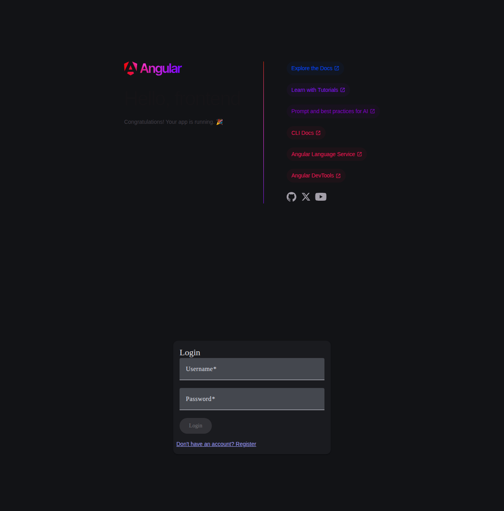
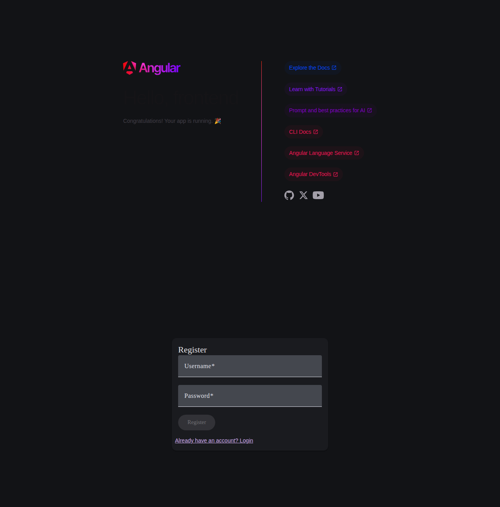
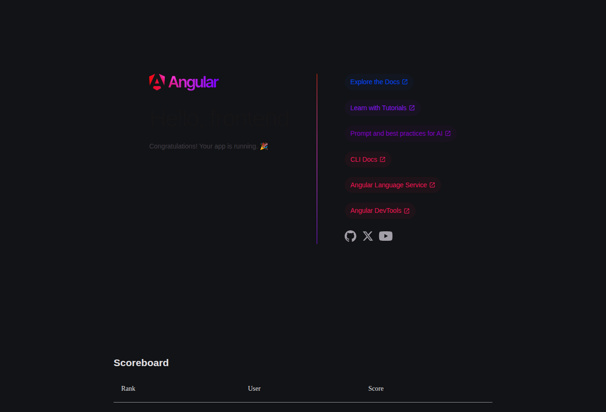
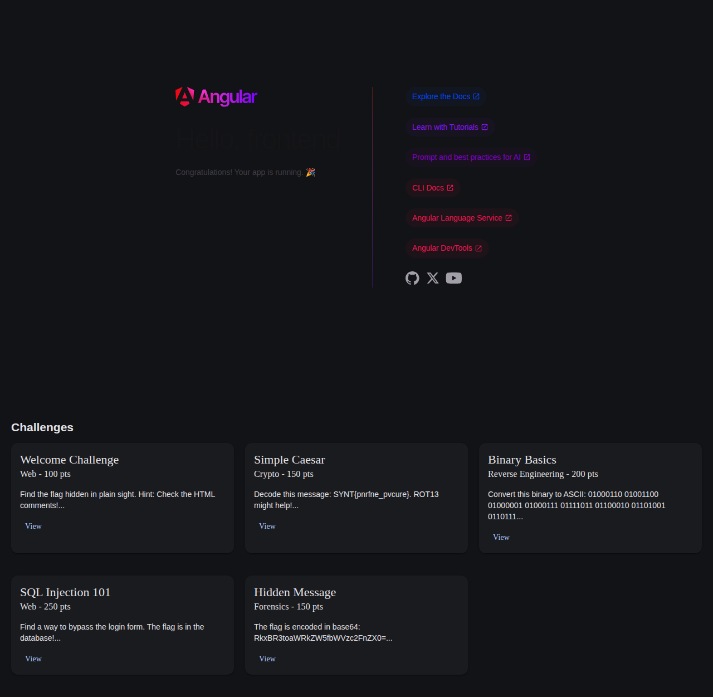
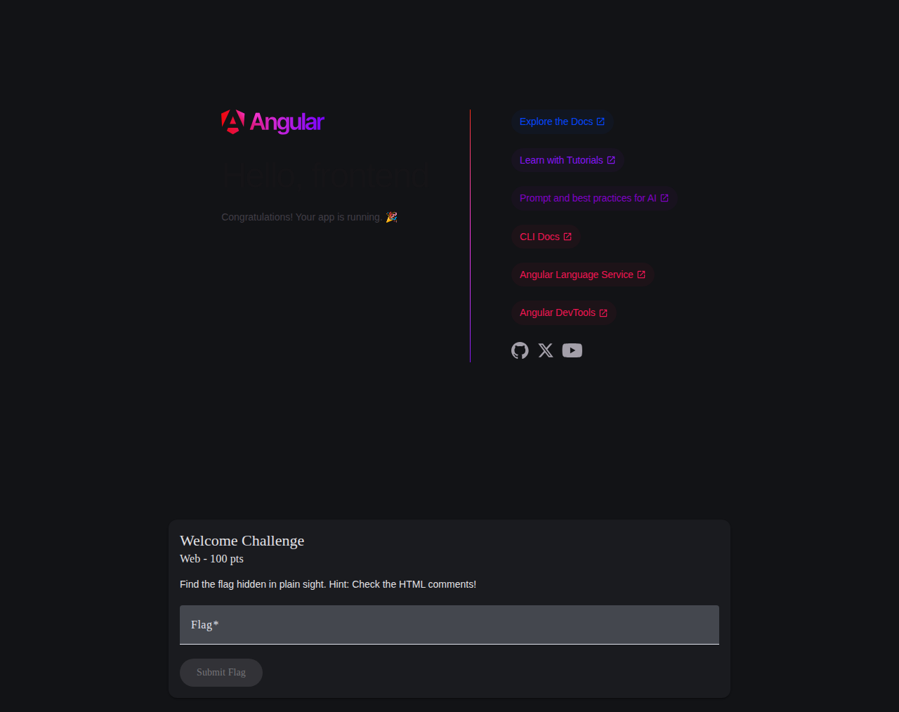
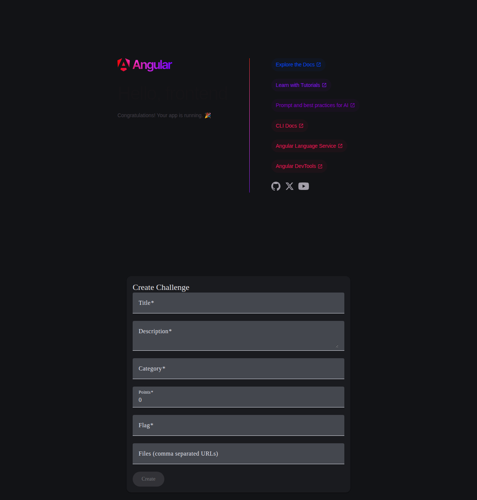

# Go CTF Platform

A full-stack Capture The Flag (CTF) platform built with Go (Gin framework) for the backend and Angular (v21) with Angular Material for the frontend.

## 🚀 Features

- **User Authentication**: Secure registration and login system with JWT tokens
- **Challenge Management**: Browse and solve CTF challenges across different categories
- **Flag Submission**: Submit flags and earn points for correct solutions
- **Scoreboard**: Real-time leaderboard tracking user rankings and scores
- **Admin Dashboard**: Administrative interface for creating and managing challenges
- **Role-Based Access Control**: Separate permissions for admins and regular users

## 🏗️ Architecture

### Backend
- **Language**: Go 1.24
- **Framework**: Gin (HTTP web framework)
- **Database**: MongoDB
- **Authentication**: JWT (JSON Web Tokens)
- **Architecture**: Clean architecture with repositories, services, and handlers

### Frontend
- **Framework**: Angular 21
- **UI Library**: Angular Material
- **State Management**: Services with RxJS
- **Styling**: SCSS

## 📋 Prerequisites

- **Go**: Version 1.24 or higher
- **Node.js**: Version 18 or higher
- **npm**: Version 11.6.0 or higher
- **MongoDB**: Version 4.4 or higher

## 🛠️ Setup Instructions

### Quick Start (Recommended)

1. **Clone the repository:**
   ```bash
   git clone https://github.com/Uttam-Mahata/go-ctf-platform.git
   cd go-ctf-platform
   ```

2. **Start MongoDB using Docker:**
   ```bash
   docker compose up -d
   ```

3. **Setup Backend:**
   ```bash
   cd backend
   cp .env.example .env
   go mod download
   go run cmd/api/main.go
   ```

4. **Setup Frontend (in a new terminal):**
   ```bash
   cd frontend
   npm install
   npm start
   ```

5. **Setup Sample Data (optional):**
   ```bash
   # First, register a user with username 'testuser' through the web interface
   # Then run the setup script to promote them to admin and add sample challenges
   bash scripts/setup-sample-data.sh
   ```

The application will be available at:
- Frontend: http://localhost:4200
- Backend API: http://localhost:8080

### Backend Setup

1. **Navigate to the backend directory:**
   ```bash
   cd backend
   ```

2. **Create a `.env` file** based on `.env.example`:
   ```bash
   cp .env.example .env
   ```

3. **Configure environment variables** in `.env`:
   ```env
   PORT=8080
   MONGO_URI=mongodb://localhost:27017
   DB_NAME=go_ctf
   JWT_SECRET=your_super_secret_jwt_key_here
   ```

4. **Install Go dependencies:**
   ```bash
   go mod download
   ```

5. **Run the backend server:**
   ```bash
   go run cmd/api/main.go
   ```

   The backend will be available at `http://localhost:8080`

### Frontend Setup

1. **Navigate to the frontend directory:**
   ```bash
   cd frontend
   ```

2. **Install dependencies:**
   ```bash
   npm install
   ```

3. **Run the development server:**
   ```bash
   npm start
   ```

   The frontend will be available at `http://localhost:4200`

## 🎮 Usage

### For Users

1. **Register**: Create a new account at `/register`
2. **Login**: Sign in with your credentials at `/login`
3. **Browse Challenges**: View available challenges at `/challenges`
4. **Solve Challenges**: Click on a challenge to view details and submit flags
5. **Check Scoreboard**: View your ranking at `/scoreboard`

### For Admins

1. **Access Admin Dashboard**: Navigate to `/admin` (requires admin role)
2. **Create Challenges**: Add new challenges with titles, descriptions, categories, points, and flags
3. **Manage Platform**: Monitor user activity and challenge submissions

## 🔑 Default Admin Setup

To create an admin user, you'll need to manually update the user role in MongoDB:

```javascript
db.users.updateOne(
  { username: "your_username" },
  { $set: { role: "admin" } }
)
```

## 🌐 API Endpoints

### Public Endpoints
- `POST /register` - User registration
- `POST /login` - User login
- `GET /scoreboard` - Get leaderboard

### Protected Endpoints (Requires Authentication)
- `GET /challenges` - List all challenges
- `GET /challenges/:id` - Get challenge details
- `POST /challenges/:id/submit` - Submit flag for a challenge

### Admin Endpoints (Requires Admin Role)
- `POST /challenges` - Create a new challenge

## 📁 Project Structure

```
go-ctf-platform/
├── backend/
│   ├── cmd/
│   │   └── api/
│   │       └── main.go          # Application entry point
│   ├── internal/
│   │   ├── config/              # Configuration management
│   │   ├── database/            # Database connection
│   │   ├── handlers/            # HTTP request handlers
│   │   ├── middleware/          # Authentication & authorization
│   │   ├── models/              # Data models
│   │   ├── repositories/        # Database operations
│   │   ├── routes/              # Route definitions
│   │   └── services/            # Business logic
│   ├── go.mod
│   └── go.sum
│
├── frontend/
│   ├── src/
│   │   ├── app/
│   │   │   ├── components/      # UI components
│   │   │   │   ├── login/
│   │   │   │   ├── register/
│   │   │   │   ├── challenge-list/
│   │   │   │   ├── challenge-detail/
│   │   │   │   ├── scoreboard/
│   │   │   │   └── admin-dashboard/
│   │   │   ├── services/        # API services
│   │   │   └── app.routes.ts    # Route configuration
│   │   ├── index.html
│   │   └── main.ts
│   ├── package.json
│   └── angular.json
│
├── screenshots/                  # Application screenshots
├── scripts/                      # Helper scripts
├── docker-compose.yml            # Docker configuration for MongoDB
└── README.md
```

## 📸 Screenshots

### Login Page


### Registration Page


### Scoreboard


### Challenge List


### Challenge Detail


### Admin Dashboard


## 🧪 Testing

### Backend
```bash
cd backend
go test ./...
```

### Frontend
```bash
cd frontend
npm test
```

## 🔨 Building for Production

### Backend
```bash
cd backend
go build -o ctf-server cmd/api/main.go
./ctf-server
```

### Frontend
```bash
cd frontend
npm run build
```

The production build will be stored in the `dist/` directory.

## 🛡️ Security Considerations

- Always use strong JWT secrets in production (minimum 32 characters)
  - Generate one using: `openssl rand -base64 32`
- Never commit `.env` files to version control
- Use HTTPS in production environments
- Implement rate limiting for API endpoints
- Regularly update dependencies for security patches
- **IMPORTANT**: The sample data script creates a test admin user with default credentials (`testuser/password123`). These are for development only - never use in production!
- Change all default passwords before deploying to production
- Consider implementing:
  - Password complexity requirements
  - Account lockout after failed login attempts
  - Email verification for new accounts
  - Two-factor authentication (2FA)

## 🤝 Contributing

1. Fork the repository
2. Create a feature branch (`git checkout -b feature/amazing-feature`)
3. Commit your changes (`git commit -m 'Add some amazing feature'`)
4. Push to the branch (`git push origin feature/amazing-feature`)
5. Open a Pull Request

## 📝 License

This project is open source and available under the [MIT License](LICENSE).

## 📧 Support

For issues and questions, please open an issue on the GitHub repository.

## 🎯 Future Enhancements

- [ ] Add hint system for challenges
- [ ] Implement team-based competitions
- [ ] Add challenge difficulty ratings
- [ ] Email verification for registration
- [ ] Password reset functionality
- [ ] Challenge tagging and filtering
- [ ] File upload for challenges
- [ ] Detailed user statistics
- [ ] Challenge writeup submissions
- [ ] Social features (comments, discussions)

---

Made with ❤️ for the CTF community
